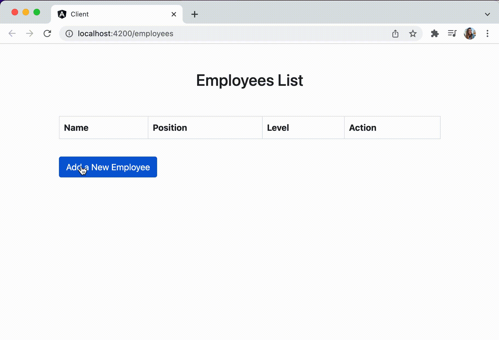

# MEAN Stack Sample Application

This is a simple CRUD application built using the MEAN (MongoDB, Express, Angular, Node.js) stack. You can also follow the step-by-step [tutorial](https://www.mongodb.com/languages/mean-stack-tutorial) for building this application.

